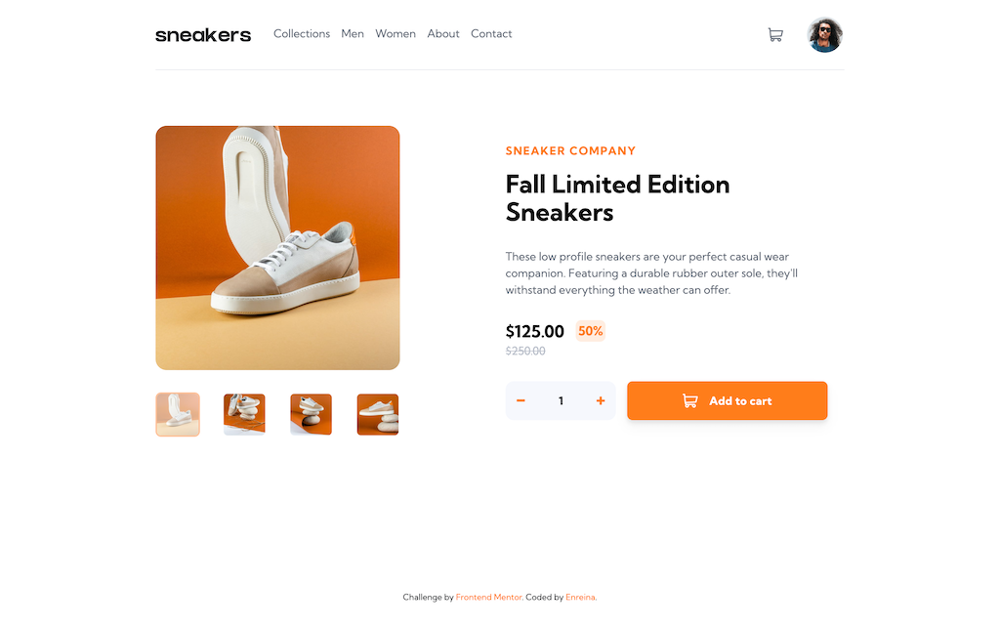
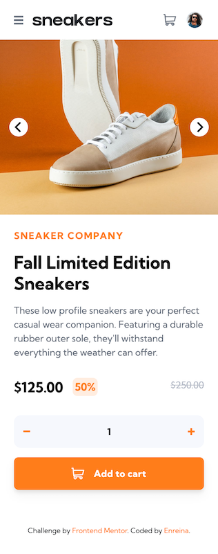

# Frontend Mentor - E-commerce product page solution

This is a solution to the [E-commerce product page challenge on Frontend Mentor](https://www.frontendmentor.io/challenges/ecommerce-product-page-UPsZ9MJp6). Frontend Mentor challenges help you improve your coding skills by building realistic projects.

## Table of contents

- [Overview](#overview)
  - [The challenge](#the-challenge)
  - [Screenshot](#screenshot)
  - [Links](#links)
- [My process](#my-process)
  - [Built with](#built-with)
  - [What I learned and Useful Resources](#what-i-learned-and-useful-resources)
  - [Continued development](#continued-development)
- [Author](#author)

## Overview

### The challenge

Users should be able to:

- View the optimal layout for the site depending on their device's screen size
- See hover states for all interactive elements on the page
- Open a lightbox gallery by clicking on the large product image
- Switch the large product image by clicking on the small thumbnail images
- Add items to the cart
- View the cart and remove items from it

### Screenshot

#### Desktop

#### Mobile

### Links

- Solution URL: [https://www.frontendmentor.io/solutions/ecommerce-product-page-using-vite-vue-ts-and-tailwind-css-sUBATQ_OSR](https://www.frontendmentor.io/solutions/ecommerce-product-page-using-vite-vue-ts-and-tailwind-css-sUBATQ_OSR)
- Live Site URL: [https://frontend-mentor-ecommerce-product-page-enreina.vercel.app/](https://frontend-mentor-ecommerce-product-page-enreina.vercel.app/)

## My process

### Built with

- [Vue.js](https://vuejs.org/)
- [Vite](https://vitejs.dev/)
- [Tailwind CSS](https://tailwindcss.com/)
- Mobile-first workflow

### What I learned and Useful Resources

- [[Vue] Composition API vs Options API](https://vuejs.org/guide/introduction.html#api-styles)
- [[Vue] State Management](https://vuejs.org/guide/scaling-up/state-management.html#state-management)
- [[Vue] Transition](https://vuejs.org/guide/built-ins/transition.html)
- [[Tailwind CSS] Breakpoints & Responsive Layout](https://tailwindcss.com/docs/responsive-design)
- [[Tailwind CSS] Removing spinner on Number Input](https://www.hyperui.dev/blog/remove-number-input-spinners-with-tailwindcss)
- [[Tailwind CSS] Styling based on parent state (group-{modifier})](https://tailwindcss.com/docs/hover-focus-and-other-states#styling-based-on-parent-state)

### Continued development

The shopping cart functionality is implemented using Vue's Reactivity API as described in the official [guide](https://vuejs.org/guide/scaling-up/state-management.html#simple-state-management-with-reactivity-api). In the case of this project, which is a single product page, it works because we don't expect user to go to different product page. In a real e-commerce website, however, this approach wouldn't work because the shopping cart would be reset to be empty once user refreshes the page.

As a next challenge, I would like to try and build a more full-fledged e-commerce website using Vue and learn more about how to use [Pinia](https://vuejs.org/guide/scaling-up/state-management.html#pinia), the state management library that's supposedly could overcome the limitation of the approach used in this project.

## Author

- Website - [Enreina](https://www.enreina.com)
- Frontend Mentor - [@enreina](https://www.frontendmentor.io/profile/enreina)
- Twitter - [@enreina\_](https://www.twitter.com/enreina_)
